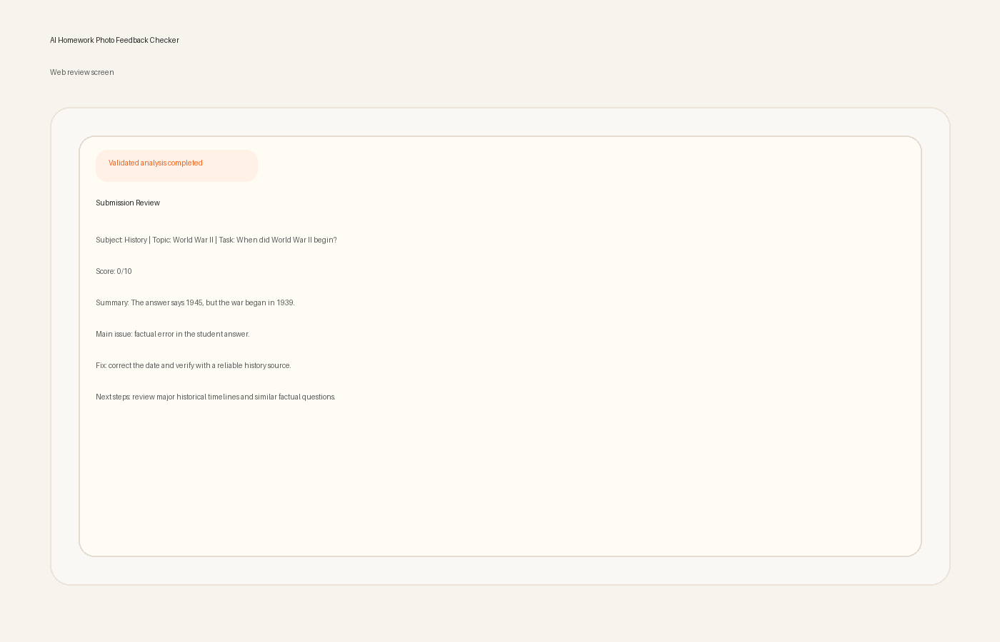
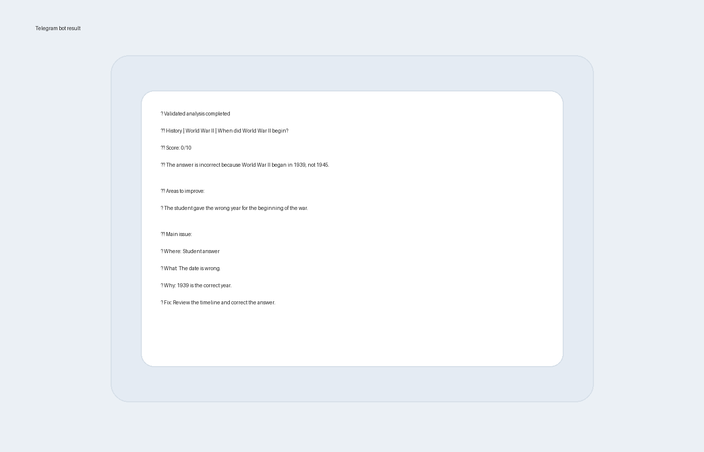

# AI Homework Photo Feedback Checker

Minimal full-stack product for grading photos of homework with a dual-AI review pipeline and one normalized result for web and Telegram.

## Demo

### Web review


### Telegram review


## Product context

### End users

- School and university students who want fast feedback on photo-based homework submissions
- Teachers or mentors who want a quick first-pass review of handwritten or photographed academic work

### Problem that the product solves for end users

- Students often have only a phone photo of their work, not a clean digital document
- Generic AI tools may give inconsistent scores, vague explanations, or treat technical failures like real grades
- Different channels such as a website and a bot can drift and show different results for the same submission

### Our solution

- Upload one homework photo in the web UI or send it to the Telegram bot
- The backend runs a strict pipeline:
  `Image -> Analyzer AI -> Validator AI -> Normalizer -> Web/Telegram`
- The analyzer reads the image and produces structured feedback
- The validator independently checks the analyzer and can override weak or inconsistent results
- A normalizer produces one final typed object so the web UI and Telegram bot use the same source of truth
- Honest failure states prevent technical errors from appearing as real grades

## Features

### Implemented

- Single-photo upload in the web UI
- Telegram bot photo submission
- Image-capable analyzer model
- Secondary validator model for score and explanation checks
- Structured JSON contracts for analyzer and validator
- Academic/non-academic classification with support for short academic answers, including humanities
- Subject-aware grading guidance for mathematics, history, literature, language, biology, geography, economics, computer science, and similar school subjects
- Deterministic quantitative guardrails for simple linear-equation mistakes
- Unified normalized result for web and Telegram
- PostgreSQL persistence with local SQLite fallback for development
- Docker Compose deployment
- Honest `analyzer_failed`, `validator_failed`, and rejected-image states

### Not yet implemented

- Authentication and per-user accounts
- Multi-image submissions
- Teacher dashboard or rubric editor
- Advanced OCR pipeline
- Rate limiting
- Rich admin analytics

## Usage

### Web

1. Open the frontend in a browser.
2. Upload a clear photo of homework, a worksheet, notebook page, or another academic answer.
3. Wait for analysis and validation.
4. Review:
   - score
   - short feedback
   - strengths
   - mistakes
   - detailed mistake explanation
   - next steps

### Telegram bot

1. Open the bot in Telegram.
2. Send one homework photo.
3. Wait for the bot to return the normalized result.
4. Read the compact summary with:
   - validation state
   - score
   - short feedback
   - main issue
   - improvement suggestions

### Recommended input

- Clear photos with readable text
- Homework questions and student answers in the same image when possible
- School or university subject content such as mathematics, history, literature, English, biology, geography, economics, or computer science

## Deployment

### VM operating system

- Ubuntu 24.04 LTS

### What should be installed on the VM

- `git`
- `docker`
- Docker Compose plugin (`docker compose`)

Example install commands on Ubuntu 24.04:

```bash
sudo apt update
sudo apt install -y git docker.io docker-compose-v2
sudo systemctl enable --now docker
sudo usermod -aG docker $USER
```

Log out and back in after adding your user to the `docker` group.

### Step-by-step deployment instructions

1. Clone the repository:

```bash
git clone https://github.com/kadambaevsanzhar/se-toolkit-hackathon.git
cd se-toolkit-hackathon
```

2. Create environment files:

```bash
cp backend/.env.example backend/.env
cp backend/.env.example .env
```

3. Edit `.env` and `backend/.env` and set the required values:

- `OPENAI_API_KEY`
- `OPENAI_BASE_URL`
- `OPENAI_ANALYZER_MODEL`
- `OPENAI_VALIDATOR_MODEL`
- `TELEGRAM_TOKEN` if you want the bot enabled

4. Build and start the stack:

```bash
docker compose up -d --build
```

5. Check service health:

```bash
curl http://localhost:8000/health
```

6. Open the product:

- Web UI: `http://YOUR_VM_IP:3000`
- Backend API: `http://YOUR_VM_IP:8000`

7. Optional: run backend tests inside the container:

```bash
docker compose exec -T backend pytest -q
```

## License

MIT
